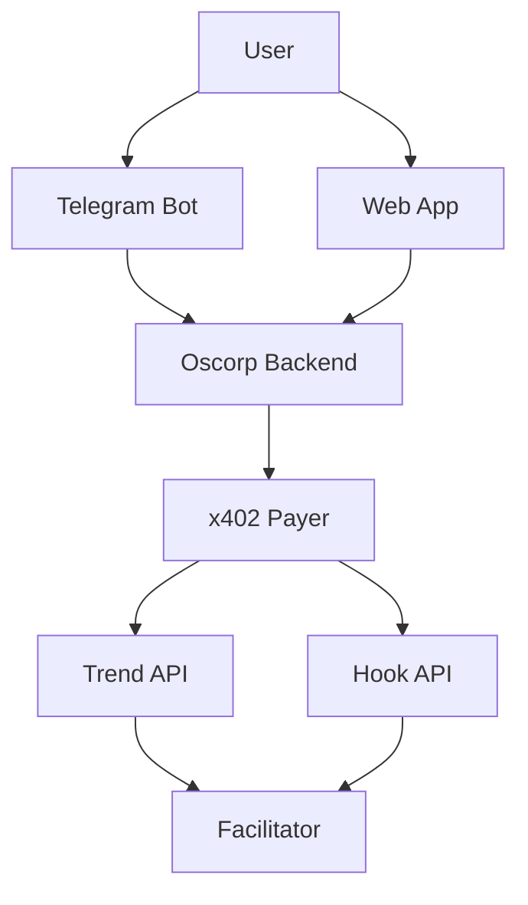

# Oscorp

**Telegram + web growth copilot for X** — your agent pays specialist APIs via x402 (TestNet USDC), Groq drafts posts, you approve every publish.

## What it does

- **Web app**: wallet → policy → fund agent → run cycles → drafts queue with x402 receipts
- **Telegram** (recommended daily flow): `/link` → `/run` → **Post on X** · **Regenerate** · **Skip**
- **x402**: USDC micropayments to trend / hook providers (tx links on each draft)
- **Regenerate**: new copy from Groq only — no extra provider spend
- **Research**: Groq pre-cycle topics/angles from policy + memory (`OSCORP_GROQ_RESEARCH_ENABLED`)

## Run a growth cycle (dev)

The backend calls **x402-payer** (`:8110`), which pays **provider-services** (`:8101`–`:8103`). If you only run the API + frontend, **Start agent** will fail with a connection error.

**Option A — full stack** (real x402 micropayments):

```bash
cd Oscorp
./scripts/dev-up.sh              # background: payer, providers, backend, telegram (if token set)
cd frontend && npm run dev       # web UI
./scripts/dev-down.sh            # stop background services
```

Or `./scripts/dev-stack.sh` for manual per-terminal control.

Minimum for one cycle: **x402-payer**, **trend-analyzer**, **hook-generator**, **backend**, **frontend**.

**Option B — stub providers** (Groq draft only, no x402):

```bash
# backend/.env
OSCORP_PROVIDER_STUB=true
```

Restart uvicorn after changing `.env`.

## Architecture (current default)



## Agents / services in the stack

| Component | Role |
|-----------|------|
| **Oscorp backend** | Orchestrator, wallet, policy, cycles |
| **Groq** | Draft copy + Telegram conversation |
| **x402-payer** | Signs USDC payments from agent wallet |
| **Provider APIs** | Trend, hook, thread specialists (paid via x402) |
| **Telegram bot** | User chat, memory, cycle triggers |
| **Frontend** | Wallet UI, onboarding, drafts |

Research uses **Groq only** (no live X API). See [docs/growth-research.md](docs/growth-research.md).

## Quick start

```bash
# 1) Env
cd backend && cp .env.example .env   # add GROQ_API_KEY, TELEGRAM_BOT_TOKEN
cd ../frontend && cp .env.example .env

# 2) See scripts/dev-stack.sh — start payer, providers, backend, telegram, frontend
./scripts/dev-stack.sh
```

Open http://127.0.0.1:5173

## Docs

- [Env setup](docs/env-setup.md)
- [Telegram](docs/telegram.md)
- [x402 on Algorand](docs/x402-algorand.md)
- [Architecture](docs/ARCHITECTURE.md)
- [Growth research (Groq)](docs/growth-research.md)

## DoraHacks pitch

**Problem:** X growth needs paid specialist tools and a controlled agent budget — not fake analytics.

**Solution:** Oscorp runs a funded **agent wallet**, pays providers via **x402 on Algorand**, drafts on **Groq**, and keeps humans in the loop before posting.
