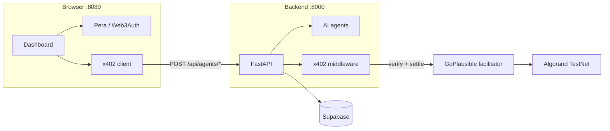
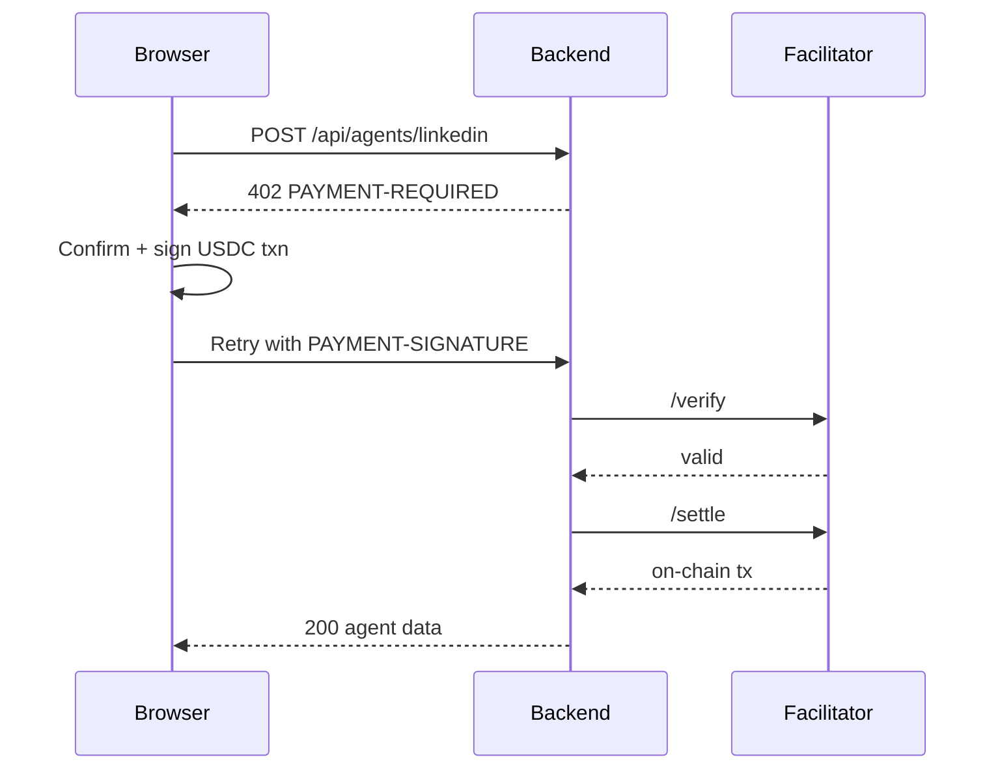

# Oscorp

Oscorp is an **AI CMO terminal** for founders and marketers. Connect an Algorand wallet, enter your website, and get SEO analysis plus AI-generated company documents. Paid content agents (Reddit, LinkedIn, Articles, Hacker News) run only after a real **x402 USDC micropayment** on TestNet — no fake checkout, no manual treasury transfers in the app.

---

## What it does

1. **Sign in** with Pera, Defly, Lute, or Web3Auth (embedded wallet).
2. **Analyze your site** — scrape, PageSpeed, Groq-generated docs (product info, competitors, brand voice, strategy, llms.txt).
3. **Run paid agents** — each action costs a small USDC amount; the browser signs the payment, the backend settles on-chain.
4. **Chat with the AI CMO** — ask about your company, competitors, or what to publish next.

User profiles, payment history, and unlocked agent content are stored in **Supabase**.

---

## How the pieces fit together



| Service | Port | Role |
|---------|------|------|
| `frontend/` | 8080 | React UI, wallet connect, signs x402 payments |
| `backend/` | 8000 | API, Groq agents, x402 gate before agent runs |
| Supabase | cloud | Users, transactions, saved agent deliverables |
| Facilitator | external | Verifies and settles USDC payments on-chain |

The `x402-payer/` package is a **shared library** (`createX402Fetch`) imported by the frontend. You do **not** need to run its optional Node proxy for normal dashboard use.

---

## x402 payment flow

When you trigger a paid agent, this happens automatically:



- **Per-action mode** — you approve each payment in a confirmation modal, then sign with your main wallet.
- **Agent-wallet mode** — fund a derived agent address with USDC; payments auto-sign from that wallet.
- **Prices & treasury** — `shared/payment-constants.json` (same file for frontend and backend).

Your wallet needs **TestNet USDC** to run paid agents. Get TestNet ALGO/USDC from a faucet if needed.

---

## Setup

**You need:** Python 3.11+, Node 20+, pnpm, a [Groq API key](https://console.groq.com), and a free [Supabase](https://supabase.com) project.

### 1. Environment files

```bash
cd Oscorp
cp backend/.env.example backend/.env
cp frontend/.env.example frontend/.env
```

Set these in `backend/.env`:

| Variable | Where to get it |
|----------|-----------------|
| `GROQ_API_KEY` | [console.groq.com](https://console.groq.com) → API Keys |
| `SUPABASE_URL` | Supabase → Project Settings → API → Project URL |
| `SUPABASE_SERVICE_KEY` | Same page → `service_role` secret (starts with `eyJ`) |

`frontend/.env` defaults work locally. Add `VITE_WEB3AUTH_CLIENT_ID` only if you use Web3Auth ([developer.metamask.io](https://developer.metamask.io)) — or run `./scripts/setup-web3auth.sh`.

### 2. Database

Open the Supabase **SQL editor** and run the entire file:

```
backend/supabase/schema.sql
```

### 3. Install

```bash
cd backend && pip install -e ".[dev]"
cd ../frontend && pnpm install
```

---

## Run

Open **two terminals** from the `Oscorp` folder:

```bash
# Terminal 1 — API
cd backend && uvicorn app.api.main:app --reload --port 8000

# Terminal 2 — UI (proxies /api → :8000)
cd frontend && pnpm dev
```

Open **http://localhost:8080**

Check the API: http://127.0.0.1:8000/health

Helper scripts: `./scripts/dev-stack.sh` prints these commands; `./scripts/dev-up.sh` starts the backend in the background.

---

## Verify x402 is working

Without a payment header, paid routes return 402:

```bash
curl -i -X POST http://127.0.0.1:8000/api/agents/linkedin \
  -H "Content-Type: application/json" \
  -d '{"productInfo":"test","postType":"lesson_learned"}'
```

You should see `PAYMENT-REQUIRED` and `x402Version: 2` in the response.

---

## Project folders

| Folder | What’s inside |
|--------|----------------|
| `frontend/` | React 19 app — dashboard, mission control, wallet, payment modals |
| `backend/` | FastAPI — `app/core/x402_middleware.py`, agent routes, Groq analysis |
| `x402-payer/` | `createX402Fetch()` for browser payments; optional `:8110` proxy for scripts |
| `shared/` | `payment-constants.json` — treasury address and agent prices |
| `docs/x402.md` | Protocol details, facilitator config, curl examples |
