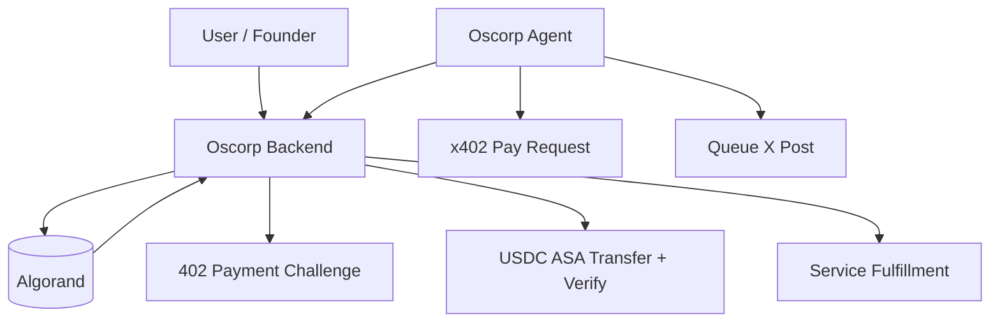

# Oscorp

Oscorp is an autonomous GTM company protocol on Algorand.

In simple terms:
- the **contract** stores company rules and treasury settings,
- the **backend** handles APIs and payment verification,
- the **agent** executes GTM actions and buys services.

## Why Algorand

We use Algorand for the parts that need trust:
- company state (name, policy, treasury, asset IDs),
- payment settlement (USDC ASA transfer),
- payment proof verification (tx id + amount + receiver).

So AI execution is off-chain, but money and rules are on-chain.

## Simple architecture



## End-to-end flow

1. Create company (`Oscorp app`).
2. Store company policy on-chain.
3. Agent requests a paid service.
4. Backend returns `402 Payment Required`.
5. Agent triggers `/x402/pay`.
6. Backend sends USDC ASA transfer and verifies on-chain.
7. Service is fulfilled.
8. Agent generates and queues outbound post text.

## Demo command (recommended)

Run this for presentation:

```bash
cd projects/Oscorp-agent
python3 -m oscorp_agent demo-cycle
```

What it shows:
- 402 challenge
- x402 payment
- on-chain payment proof
- service fulfillment
- AI-style generated post text (queued, not live-posted)

## Quick setup

```bash
# 1) LocalNet
algokit localnet start

# 2) Backend
cd projects/Oscorp-backend
pnpm install
cp .env.example .env
pnpm run dev

# 3) Agent
cd ../Oscorp-agent
pip3 install --user -e .
cp .env.example .env
python3 -m oscorp_agent demo-cycle
```

## Required env keys (minimal)

Backend (`projects/Oscorp-backend/.env`):
- `USDC_ASSET_ID`
- `OSCORP_API_KEY`
- `OSCORP_PAYMENT_MNEMONIC`

Agent (`projects/Oscorp-agent/.env`):
- `OSCORP_API_URL`
- `OSCORP_API_KEY` (must match backend)
- `OSCORP_ID`
- `TX_EXPLORER_BASE_URL`

## Repo layout

```text
Oscorp/
├── projects/Oscorp-contracts
├── projects/Oscorp-backend
└── projects/Oscorp-agent
```

## Current status

- `demo-cycle` is stable for stage demos
- `start` mode uses LLM continuously and can be rate-limited
- replay protection is currently in-memory
